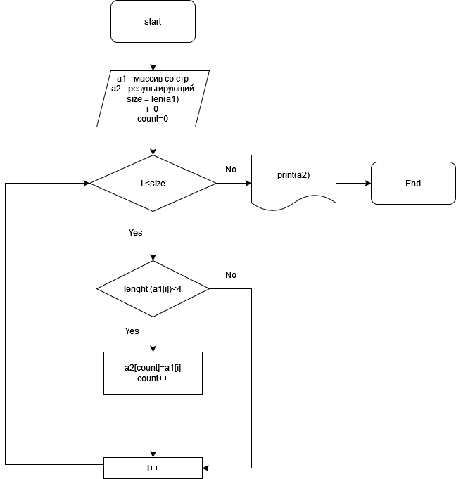

## Задача:
*Написать программу, которая из имеющегося массива строк формирует новый массив из строк, длина которых меньше, либо равна 3 символам. Первоначальный массив можно ввести с клавиатуры, либо задать на старте выполнения алгоритма. При решении не рекомендуется пользоваться коллекциями, лучше обойтись исключительно массивами.*
### 1. Блок - схема
Блок - схема представлена на изображении 
### 2. Решение задачи
Решение задачи на языке программирования С# расположенна в файле ex_C#.